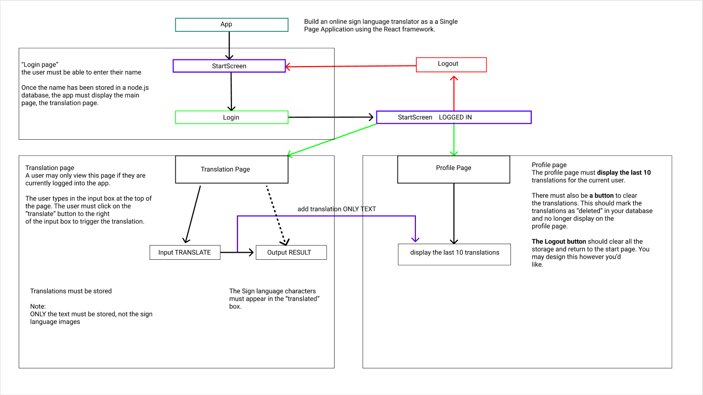
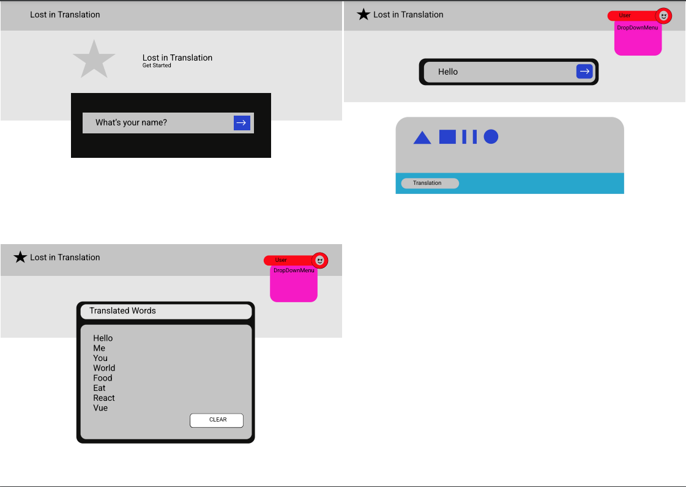

# lost-in-translation

[](https://github.com/RichardLitt/standard-readme)
[](https://lost-in-translation-2022.herokuapp.com/)
Lost in Translation - Single Page Application with React.js library - Noroff Assignment 3

The application has one main feature: to act as a “translator” from regular text to sign language. The application translates words and short sentences to American sign language. 

## Table of Contents

- [Install](#install)
- [Usage](#usage)
- [Component tree](#component-tree)
- [UI sketch](#UI-sketch)
- [Maintainers](#maintainers)
- [Contributing](#contributing)
- [License](#license)

## Install

```
$ git clone https://github.com/bgf122/Lost_in_Translation.git
$ cd lost_in_translation
$ npm install
```

## Usage

in your app root directory

```
$ npm start 
```

Runs the app in the development mode.\
Open [http://localhost:3000](http://localhost:3000) to view it in your browser.

## Component tree



## UI sketch



## Maintainers

[@bgf122](https://github.com/bgf122)
[@teemunasanen](https://github.com/teemunasanen)

## Contributing
[@bgf122](https://github.com/bgf122)
[@teemunasanen](https://github.com/teemunasanen)


Small note: If editing the README, please conform to the [standard-readme](https://github.com/RichardLitt/standard-readme) specification.

## License

MIT © 2022 Sasu Korhonen and Teemu Näsänen

----
